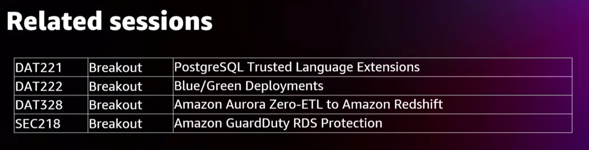
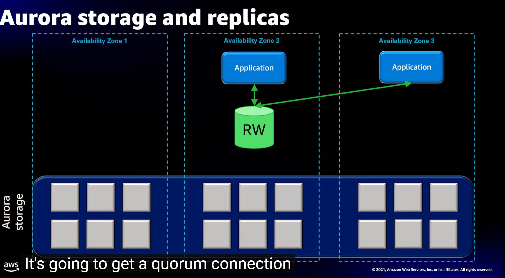
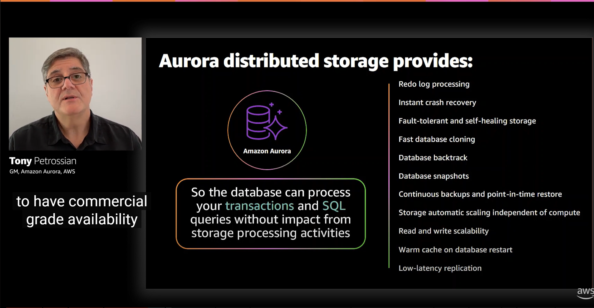
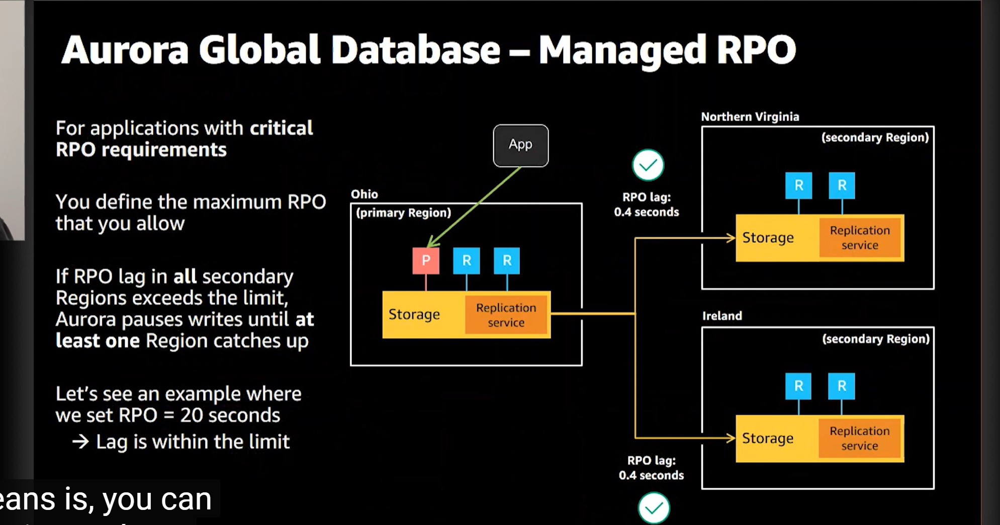
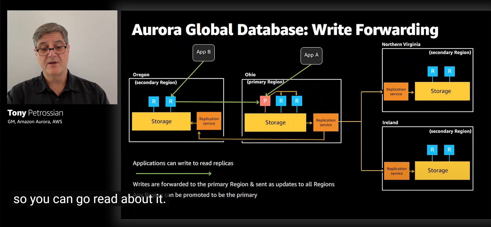

[AWS re:Invent 2020: Deep dive on best practices for Amazon Redshift](https://www.youtube.com/watch?v=13iIj34nkQE)

[AWS re:Invent 2022 - [NEW] Amazon Redshift: 10 yrs of integration & data sharing innovation (ANT345)](https://www.youtube.com/watch?v=eIZcoXg39tg)

[How Amazon Aurora Works | Amazon Aurora Architecture | Cloud Database Architecture](https://www.youtube.com/watch?v=I4uOEoUYPC8&t=79s)

[serverless](https://www.youtube.com/watch?v=vUbs0PfnfEw)

[Design for Highly-Available Database Using Amazon Aurora](https://aws.plainenglish.io/design-for-highly-available-database-using-amazon-aurora-c0532b49386d)

[AWS re:Invent 2022 - Deep dive into Amazon Aurora and its innovations (DAT326)](https://www.youtube.com/watch?v=pzZydB78Eyc&t=1279s)

[AWS re:Invent 2021 - Deep dive on Amazon Aurora](https://www.youtube.com/watch?v=SEXbvl2oQGs)

